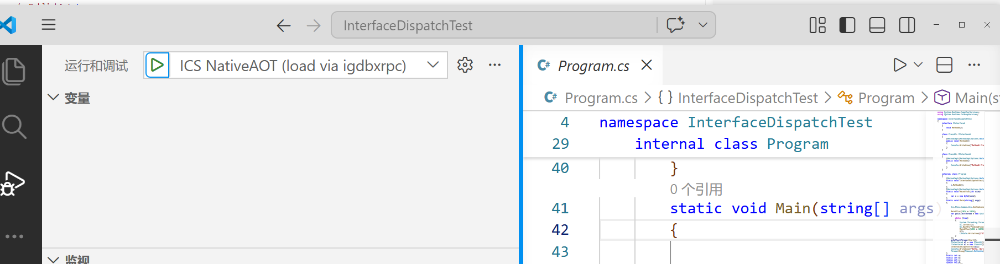
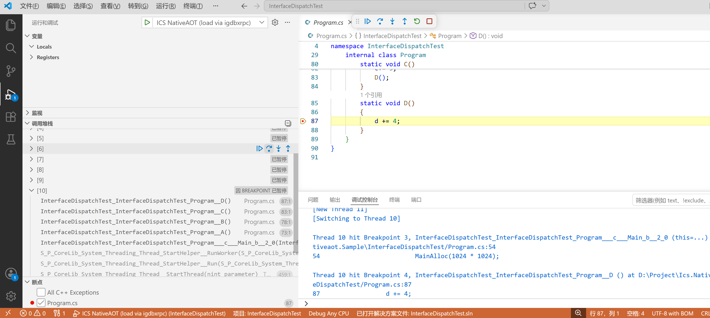

# ICS CSharp Board SDK Guide

中文版: [中文说明](./readme.md)

With this SDK, you can build embedded applications for the target board directly in C#, without writing business logic in C or manually integrating the underlying NativeAOT toolchain.

Target board:


## Requirements

- Windows
- [.NET 10 SDK](https://dotnet.microsoft.com/en-us/download/dotnet/10.0)
- [ICS C# SDK](https://gitee.com/ICS_PUBLIC/ics-csharp-sdk)

## Step 1: Publish the SDK

After downloading the SDK, run the following command in the SDK root directory:

```powershell
python .\publish_ics_csharp_sdk.py
```

## Step 2: Create a User Project

Create a new directory for your project, then add a .csproj file like this:

```xml
<Project Sdk="Microsoft.NET.Sdk">

    <PropertyGroup>
        <OutputType>Exe</OutputType>
        <TargetFramework>net10.0</TargetFramework>
        <ImplicitUsings>enable</ImplicitUsings>
        <Nullable>enable</Nullable>
        <IcsCSharpSdk>D:\Project\ICS_CSharpBoardSdk\ICS</IcsCSharpSdk>
        <DisableUnsupportedError>true</DisableUnsupportedError>
        <InvariantGlobalization>true</InvariantGlobalization>
        <AllowUnsafeBlocks>True</AllowUnsafeBlocks>
    </PropertyGroup>

    <ItemGroup>
        <ProjectReference Include="$(IcsCSharpSdk)\csharp_libs\Ics.Rtos\Ics.Rtos.Common\Ics.Rtos.Common.csproj" />
    </ItemGroup>

    <Import Project="$(IcsCSharpSdk)\targets\Ics.NativeAot.Nuttx.targets" />

</Project>
```

Notes:

- Update IcsCSharpSdk to the actual SDK path on your machine.
- You can add or remove ProjectReference entries as needed. The sample above uses the common RTOS library.

## Step 3: Write Your Application

Create Program.cs in your project directory and add your application logic. For example:

```csharp
using System;
using System.Threading;
using Ics.Rtos.Common;

Ics.Initialize();
Console.WriteLine("Hello from C# on embedded board!");

while (true)
{
    Thread.Sleep(1000);
}
```

You can write your business logic with standard C# syntax. The SDK handles the runtime and target-side integration.

## Step 4: Build the Project

Run one of the following commands in your project directory:

```bash
dotnet publish -c Release -r linux-arm /p:PublishAot=true -p:Platforms=ARM32
```

or

```bash
dotnet publish -c Debug -r linux-arm /p:PublishAot=true -p:Platforms=ARM32
```

After a successful build, the output files are typically located here:

```text
ics_nativeaot_user\build\ics_nativeaot_user.bin
ics_nativeaot_user\build\ics_nativeaot_user.elf
ics_nativeaot_user\build\ics_nativeaot_user.map
```

## Step 5: Debugging in SDRAM

When starting a debug session in VS Code, select load via igdbxrpc to load and debug the target program.

Typical workflow:

1. Open the corresponding VS Code workspace for your project.
2. Select load via igdbxrpc in the debug configuration list.
3. Start debugging. The program will be loaded into SDRAM first, and then the debug session will begin.

Load stage example:



Debug session example:



## Step 6: Flash to SD NAND and Enable Boot Startup

If you want the program to remain available after power-off and start automatically on boot, write the generated firmware file into the device file system.

First, start the igdbxrpc shell on the PC side:

```powershell
cd .\PcTools\GdbServer
.\Ics.IgdbXrpc.GdbServer.exe shell --serial COM9
```

After the connection is established, you will enter the igdbxrpc interactive prompt. Run a command like the following to write the generated bin file to the board:

```text
(igdbxrpc) fwrite D:\Project\Ics.Nativeaot.Sample\InterfaceDispatchTest\ics_nativeaot_user\build\ics_nativeaot_user.bin /dev/firmware
```

After the write is complete, run the following command in NSH on the device side:

```text
debug off
```

Then reboot the device.

If you want to see the commands supported by the igdbxrpc shell, run:

```text
(igdbxrpc) help
```

Common capabilities include:

- Viewing threads and registers
- Stepping, continuing, and setting breakpoints
- Reading and writing target memory
- Uploading and downloading files
- Executing an image from a specified memory address

## Contact

- Email: snikeguo@foxmail.com